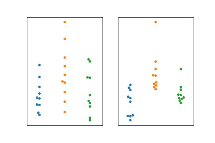
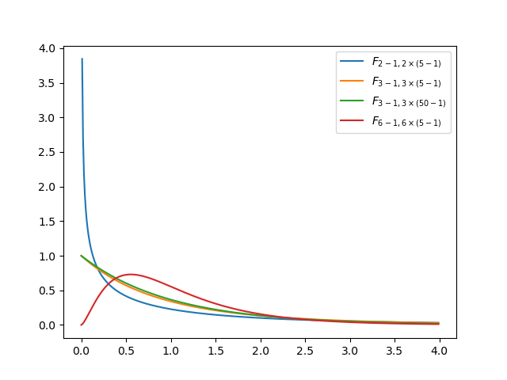
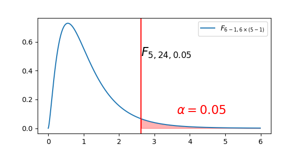

#+LATEX_COMPILER: xelatex
#+STARTUP: beamer
#+LaTeX_CLASS: beamer
#+LATEX_CLASS_OPTIONS: [presentation,bigger,aspectratio=169]
#+OPTIONS:   H:2  toc:nil ^:{} email:t tex:t
#+SELECT_TAGS: export
#+EXCLUDE_TAGS: noexport
#+BEAMER_THEME: Rochester [height=40pt]
#+BEAMER_COLOR_THEME: seahorse
#+BEAMER_FONT_THEME: structurebold
#+BEAMER_HEADER: \setbeamertemplate{footline}{\begin{beamercolorbox}[wd=\paperwidth,ht=2.5ex,dp=1ex]{author in head/foot}\hspace{2ex}\insertshortauthor\hfill\insertshorttitle\hfill\insertpagenumber\hspace{2ex}\end{beamercolorbox}}
#+LATEX_HEADER: \usepackage{minted}
#+LATEX_HEADER: \usepackage{amssymb}
#+LATEX_HEADER: \setminted{frame=single}
#+LATEX_HEADER: \setbeamertemplate{navigation symbols}{}
#+LATEX_HEADER: \usepackage{caption}
#+LATEX_HEADER: \usepackage[english]{datetime2}
#+LATEX_HEADER: \DTMsetdatestyle{iso}
#+LATEX_HEADER: \usepackage{graphicx}
#+LATEX_HEADER: \usepackage{booktabs}
#+latex_header: \AtBeginSection[]{\begin{frame}<beamer>\frametitle{Topic}\tableofcontents[currentsection]\end{frame}}

#+PROPERTY: header-args:python  :session odes

#+TITLE: Lesson 11: Analysis of Variance (ANOVA)
#+AUTHOR: Subhasis Ray
#+EMAIL: ray dot subhasis at gmail dot com
#+DATE: Created 2026-09-03 Updated: \today
#+LANGUAGE: eng

* Hypothesis testing for more than two populations with normal distribution

** XKCD: Significant
"'So, uh, we did the green study again and got no link. It was probably a--' 'RESEARCH CONFLICTED ON GREEN JELLY BEAN/ACNE LINK; MORE STUDY RECOMMENDED!'"

- This is called /“data mining”/, also, /“going on a fishing expedition”/!

- *When you test multiple hypotheses using the same data, you must do Multiple Comparison Correction*

** ANalysis Of VAriance
When you have more than 2 groups or categories, t-test is not ideal.

| Category / Level / Factor | Group 1   | Group 2   | Group 3   |
|---------------------------+-----------+-----------+-----------|
| Mean                      | $\mu_{1}$ | $\mu_{2}$ | $\mu_{3}$ |
|                           |           |           |           |

$H_{0}: \mu_{1} = \mu_{2} = \mu_{3}$

$H_{1}:$ The means are not all equal

** ANOVA conditions
- The samples are independent
- Each group approximately normal
- Similar variance

** ANOVA intuition: Compare variability between groups to pooled variance
#+CAPTION: Two examples of samples (three groups), left - from the same distribution, right - from different distributions
#+ATTR_LATEX: :height 0.6\textheight

** ANOVA - first way to estimate population variance
- We have $k$ treatment groups $G_{1}, G_{2}, \cdots, G_{k}$
- Sample means of these groups are respectively $\bar{X_{1}}, \bar{X_{2}}, \cdots, \bar{X_{k}}$
- Sample variances are $S_{1}^{2}, S_{2}^{2}, \cdots, S_{k}^{2}$
- An estimate of the population variance is the average of the sample variances:

  $\frac{1}{k}\sum_{i=1}^{k} S_{i}^{2}$

** ANOVA - second way to estimate population variance
- If $H_{0}$ is true, i.e., $\mu_{1} = \mu_{2} = \cdots = \mu_{k} = \mu$, then each group is a sample from the same distribution
- The group means $\bar{X_{1}}, \bar{X_{2}}, \cdots, \bar{X_{k}}$ come from the same normal distribution
- This is $\mathcal{N}(\mu, \sigma^{2}/n)$ - the normal distribution with mean $\mu$, and variance $\sigma^{2}/n$
- (remember, $n$ is the size of each group and $\sigma$ is the population SD)
- Then the sample variance of the  $\bar{X}_{i}$ 's   would be an estimator of $\sigma^{2}/n$

\bigskip

The sample variance of $\bar{X_{i}}$'s is (with Bessel's correction) $\bar{S}^{2} = \frac{1}{k-1}\sum_{i=1}^{k}{(\bar{X_{i}} - \bar{\bar{X}})^{2}}$, where $\bar{\bar{X}}$ is the mean of the means ($\bar{X_{i}}$)
** ANOVA - second way to estimate population variance
- $\bar{S}^{2} = \frac{1}{k-1}\sum_{i=1}^{k}{(\bar{X_{i}} - \bar{\bar{X}})^{2}}$ estimates $\sigma^{2}/n$ when $H_{0}$ is true
- Therefore, $n\bar{S}^{2}$ estimates $\sigma^{2}$ under $H_{0}$
- If $H_{0}$ is false, i.e., the population means are different, then it will overestimate $\sigma^{2}$
- We can use the ratio of the two estimates of $\sigma^{2}$ to see how far off we are
- $TS = \frac{n\bar{S}^{2}}{\sum_{i=1}^{k}S_{i}^{2}/k}$
** ANOVA - F-distribution and rejecting $H_{0}$
- $TS = \frac{n\bar{S}^{2}}{\sum_{i=1}^{k}S_{i}^{2}/k}$ follows a probability distribution called $F-distribution$
- The numerator $n\bar{S}^{2}$ has $k-1$ degrees of freedom (DoF) as out of $k$ sample means we lost 1 DoF for computing the mean of the means $\bar{\bar{X}}$
- The denominator $\sum_{i=1}^{k}S_{i}^{2}/k$ has $k (n - 1) = N - k$ DoF where $N = kn$ is the total number of data points
  - For each of the $k$ groups, the $S_{i}$ computation has $n-1$ DoF
- $F-distributions$ are specified as $F_{r,s}$ where $r$ is the DoF for the numerator and $s$ is the DoF for the denominator
- We are looking at $F_{k-1,k(n-1)}$
** ANOVA - F-distribution and rejecting $H_{0}$
#+begin_src python :session L11 :results none :output none :exports none
  import numpy as np
  import matplotlib.pyplot as plt
  import scipy.stats as stats
  x = np.arange(0, 4, 0.01)
  fig, ax = plt.subplots()
  k, n = 2, 5
  y = stats.f.pdf(x, k-1, k * (n-1))
  ax.plot(x, y, label=rf'$F_{{{k}-1, {k}\times ({n}-1)}}$')
  k, n = 3, 5
  y = stats.f.pdf(x, k-1, k * (n-1))
  ax.plot(x, y, label=rf'$F_{{{k}-1, {k}\times ({n}-1)}}$')
  k, n = 3, 50
  y = stats.f.pdf(x, k-1, k * (n-1))
  ax.plot(x, y, label=rf'$F_{{{k}-1, {k}\times ({n}-1)}}$')
  k, n = 6, 5
  y = stats.f.pdf(x, k-1, k * (n-1))
  ax.plot(x, y, label=rf'$F_{{{k}-1, {k}\times ({n}-1)}}$')
  ax.legend()
  fig.savefig('F_distribution.png')
#+end_src

#+ATTR_LATEX: :height \textheight

** ANOVA - F-distribution and rejecting $H_{0}$
For a given significance level $\alpha$, we can reject $H_{0}$ if $\text{TS} \ge F_{k-1, k(n-1), \alpha}$.

\bigskip

Alternatively, we can report $p\text{-value} = P(X \ge TS) = P(F_{k-1, k (n-1)}\ge \text{TS})$.
#+begin_src python :session L11 :results none :output none :exports none
  import numpy as np
  import matplotlib.pyplot as plt
  import scipy.stats as stats
  x = np.arange(0, 6, 0.01)
  fig, ax = plt.subplots()
  k, n = 6, 5
  y = stats.f.pdf(x, k-1, k * (n-1))
  alpha = 0.05
  f = stats.f.ppf(1 - alpha, dfn=k-1, dfd=k * (n - 1))
  ax.plot(x, y, label=rf'$F_{{{k}-1, {k}\times ({n}-1)}}$')
  ax.fill_between(x, y, where=(x >= f), color='red', alpha=0.3)
  ax.axvline(f, color='red')
  ax.annotate(rf'$F_{{{k-1}, {k * (n-1)}, {alpha:0.2f}}}$', (f, 0.5), horizontalalignment='left', fontsize='xx-large')
  ax.annotate(rf'$\alpha={alpha:0.2f}$', (f+1, 0.1), horizontalalignment='left', fontsize='xx-large', color='red')
  ax.legend()
  fig.set_size_inches(6,3)
  fig.savefig('F_distribution_alpha.png')
#+end_src

#+ATTR_LATEX: :height 0.8\textheight

** A haiku of significance                                  :B_ignoreheading:

#+begin_example
    Little p-value
    What are you trying to say
    Of significance?

-- Stephen Ziliak,
   Professor of Economics, Roosevelt University
#+end_example
