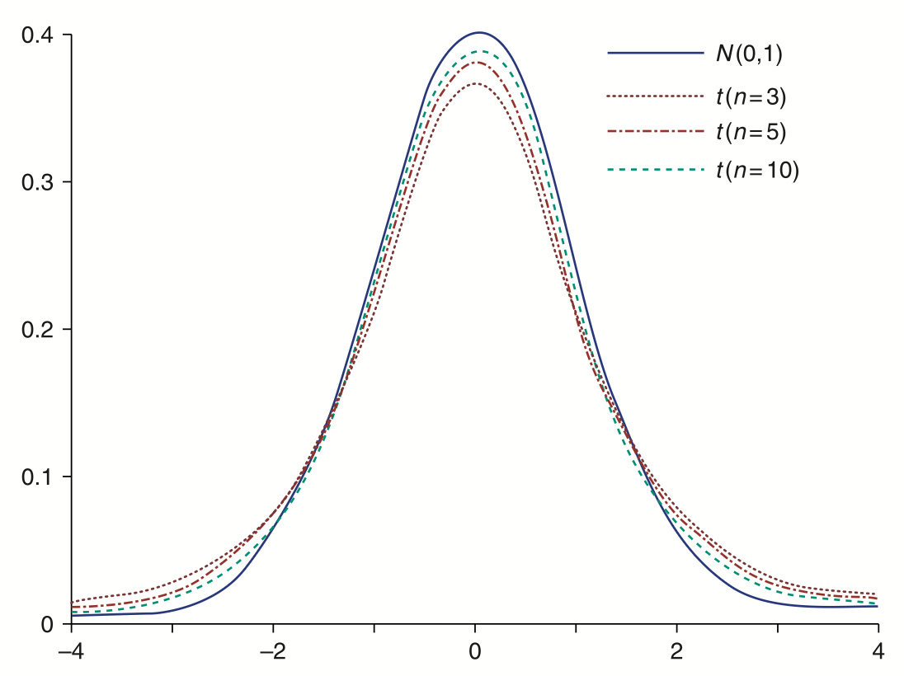
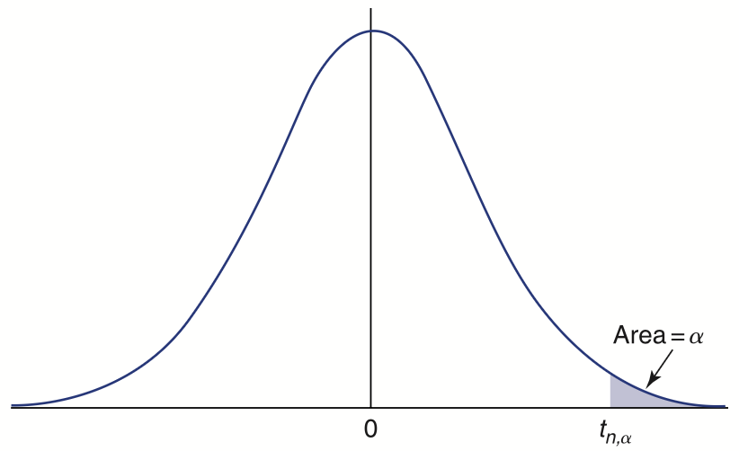
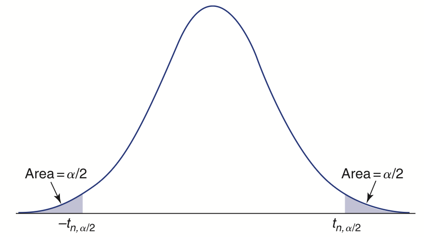

#+LATEX_COMPILER: xelatex
#+STARTUP: beamer
#+LaTeX_CLASS: beamer
#+LATEX_CLASS_OPTIONS: [presentation,bigger,aspectratio=169]
#+OPTIONS:   H:2  toc:nil ^:{} email:t tex:t
#+SELECT_TAGS: export
#+EXCLUDE_TAGS: noexport
#+BEAMER_THEME: Rochester [height=40pt]
#+BEAMER_COLOR_THEME: seahorse
#+BEAMER_FONT_THEME: structurebold
#+BEAMER_HEADER: \setbeamertemplate{footline}{\begin{beamercolorbox}[wd=\paperwidth,ht=2.5ex,dp=1ex]{author in head/foot}\hspace{2ex}\insertshortauthor\hfill\insertshorttitle\hfill\insertpagenumber\hspace{2ex}\end{beamercolorbox}}
#+LATEX_HEADER: \usepackage{minted}
#+LATEX_HEADER: \usepackage{amssymb}
#+LATEX_HEADER: \setminted{frame=single}
#+LATEX_HEADER: \setbeamertemplate{navigation symbols}{}
#+LATEX_HEADER: \usepackage{caption}
#+LATEX_HEADER: \usepackage[english]{datetime2}
#+LATEX_HEADER: \DTMsetdatestyle{iso}
#+LATEX_HEADER: \usepackage{graphicx}
#+LATEX_HEADER: \usepackage{booktabs}
#+latex_header: \AtBeginSection[]{\begin{frame}<beamer>\frametitle{Topic}\tableofcontents[currentsection]\end{frame}}

#+PROPERTY: header-args:python  :session odes

#+TITLE: Lesson 6: Confidence interval for mean of population with unknown variance
#+AUTHOR: Subhasis Ray
#+EMAIL: ray dot subhasis at gmail dot com
#+DATE: Created 2026-08-05 Updated: \today
#+LANGUAGE: eng
* Chi-squared distribution
** Sampling distribution of variance of normal population: $\chi^{2}$ distribution
- Sampling distribution of mean follows normal distribution according to CLT
- But variance does not: it follows something called $\chi^{2}$ (chi-squared) distribution
  - It is the distribution of the sum of squared standard normal rvs
  - In other words, $Y = Z_{1}^{2} + Z_{2}^{2} + \cdots + Z_{n}^{2}$, is called a $\chi^{2}$ rv with /n degrees of freedom/ (DoF)
  - $E[Y] = n$
** Mean of the Chi square distribution with $n$ degrees of freedom is $n$
#+begin_export latex
\begin{align*}
1 &= \text{Var}(Z)\\
&= E[Z^{2}] - (E[Z])^{2}\\
&= E[Z^{2}]
\end{align*}
#+end_export
Therefore, $E\left[\sum_{i=1}^{n}Z_{i}^{2}\right] = \sum_{i=1}^{n}E[Z_{i}^{2}] = \sum_{i=1}^{n} 1 = n$
** $(n-1)\frac{S^{2}}{\sigma^{2}}$ has $\chi^{2}$ distribution with $n-1$ DoF
- The standardized rv $\sum_{i}\frac{(X_{i} - \mu)^2}{\sigma^{2}}$ has a chi-squared distribution with $n$ DoF
- Intuitively, if we estimate $\mu$ with sample mean $\bar{X}$, we lose 1 degree of freedom
  - Once we know $\bar{X}$, only $n-1$ of the X's are independent, the $n$ -th $X$ is already determined by $\bar{X}$ and $X_{1} \cdots X_{n-1}$
* Interval estimator of population mean with unknown variance
** t-distribution
- The standardized sample mean has a standard normal distribution, $Z = \frac{\bar{X} - \mu}{\sigma/\sqrt{n}}$
- If we estimate $\sigma$ by sample SD $S$, then the new rv $\frac{\bar{X} - \mu}{S/\sqrt{n}} = T_{n-1}$ has a t-distribution with $n - 1$ degrees of freedom
  - Why $n-1$ DoF?
    - We are replacing $\sigma$ by $S$, and $(n-1)\frac{S^{2}}{\sigma^{2}}$ has $\chi^{2}$ distribution with $n-1$ DoF
- pdf of t-distribution is a bell curve, but slightly flatter than normal distribution, getting closer to normal as $n$ increases
** t-distribution
#+CAPTION: pdf of t-distributions with different DoF (n)
#+ATTR_LATEX: :height 0.7\textheight

** $t_{n,\alpha}$ is the $100(1-\alpha)$ percentile of the t-distribution with DoF=n
*** Left                                                              :BMCOL:
:PROPERTIES:
:BEAMER_col: 0.5
:END:
- Just like $z_{\alpha}$, $P(T_{n} > t_{n,\alpha}) = \alpha$
- $P(T_{n} < t_{n,\alpha}) = 1 - \alpha$
- $P(T_{n} < t_{n, 0.05}) = 0.95$
*** Right                                                             :BMCOL:
:PROPERTIES:
:BEAMER_col: 0.5
:END:
#+CAPTION: $P(T_{n} > t_{n,\alpha}) = \alpha$
#+ATTR_LATEX: :width 0.8\textwidth

** $P(|T_{n}| < t_{n,\alpha/2}) = 1 - \alpha$
- Again, like $z_{\alpha/2}$, $P(|T_{n}| \le t_{n,\alpha/2}) = P(-t_{n,\alpha/2} \le T_{n} \le t_{n,\alpha/2}) = 1 - \alpha$
  #+ATTR_LATEX: :height 0.6\textheight
  
** Confidence interval of mean of population with unknown variance
- Just like the known variance ($\sigma^{2}$) case, $P\left(\frac{|\bar{X} - \mu|}{S/\sqrt{n}} \le t_{n-1,\alpha/2}\right) = 1 - \alpha$
- $\bar{X} \pm \frac{S}{\sqrt{n}}t_{n-1, \alpha/2}$ is a $100(1 - \alpha)$ percent CI estimator for population mean
** If we are only interested in whether $\mu$ is above or below some value
- A $100 (1- \alpha)$ lower confidence bound for $\mu$ is $\bar{X} - z_{\alpha} \frac{\sigma}{\sqrt{n}}$
  - For unknown variance: $\bar{X} - t_{n-1,\alpha} \frac{S}{\sqrt{n}}$
- A $100 (1- \alpha)$ upper confidence bound for $\mu$ is $\bar{X} + z_{\alpha} \frac{\sigma}{\sqrt{n}}$
  - For unknown variance: $\bar{X} + t_{n-1,\alpha} \frac{S}{\sqrt{n}}$
- Note that we are using $z_{\alpha}$ as opposed to of $z_{\alpha/2}$ for CI (why?)
* Sample size
** How many samples do you need to be 90% certain that your sample mean is correct within $\pm 0.1$ units?
- 90% CI will have $\alpha/2 = \frac{(100 - 90)/100}{2} = 0.05$
- Thus, for sample size of $n$ you have 90% confidence that $\mu$ is within $\bar{X} \pm \frac{\sigma}{\sqrt{n}}z_{\alpha/2}$
- $0.1 = \frac{\sigma}{\sqrt{n}}z_{0.05}$, you know $\sigma$ and $z_{0.05}$, find $n$
- In general, we can make $b$ the length of the estimator (interval) for $100 (1 - \alpha)$ percent CI
  - That is, we are looking to make the CI $\pm b/2$ around $\bar{X}$
  - $b/2 = \frac{\sigma z_{\alpha/2} }{\sqrt{n}}$
  - Sample size $n$ should satisfy: $n \ge \left(\frac{2 \sigma z_{\alpha/2} }{b}\right)^{2}$
