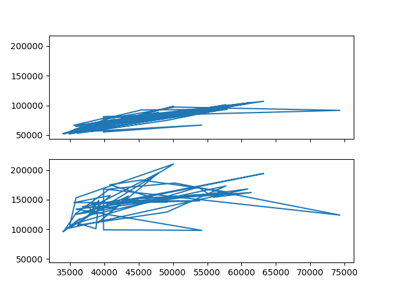
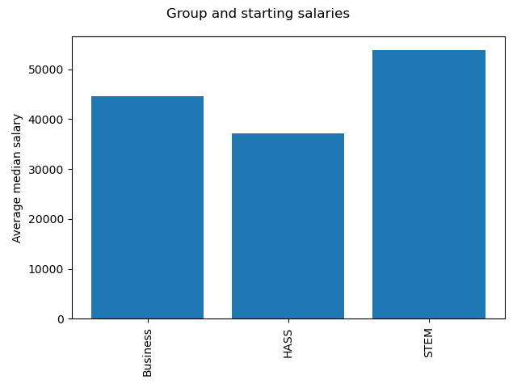
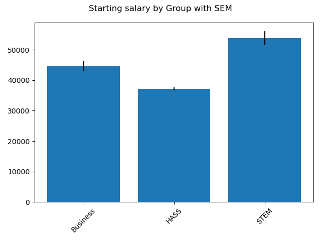
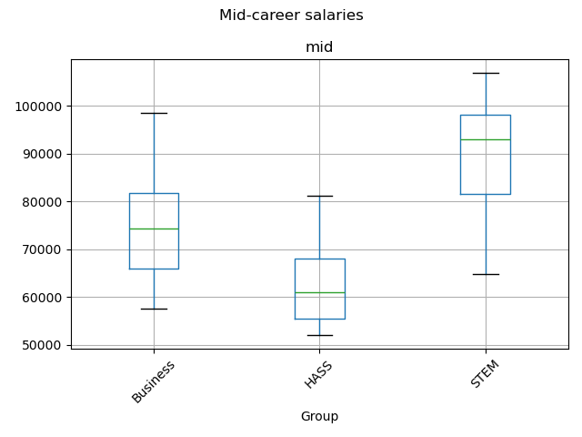

#+options: ':nil *:t -:t ::t <:t H:3 \n:nil ^:t arch:headline
#+options: author:t broken-links:nil c:nil creator:nil
#+options: d:(not "LOGBOOK") date:t e:t email:t f:t inline:t num:t
#+options: p:nil pri:nil prop:nil stat:t tags:t tasks:t tex:t
#+options: timestamp:nil title:t toc:nil todo:t |:t

#+LATEX_COMPILER: xelatex
#+LaTeX_HEADER: \usepackage{minted}
#+LaTeX_HEADER: \usemintedstyle{manni}
#+LaTeX_HEADER: \setminted{frame=single, framesep=2mm, breaklines=true, breakanywhere=true}

#+TITLE: P4: Getting started with ~pandas~ for data analysis
#+date: Created: 2022-09-29 Thu, Updated: 2026-08-04
#+author: Subhasis Ray
#+email: ray.subhasis@gmail.com
#+language: en
#+select_tags: export
#+exclude_tags: noexport
#+creator: Emacs 27.2 (Org mode 9.5.4)
#+cite_export:

#+name: matplotlib-backend
#+begin_src  python :session P4 :exports none :results none :tangle no
  #%% imports
  import matplotlib

  matplotlib.use('Agg')
#+end_src

- Look at matplotlib tutorial here: https://matplotlib.org/stable/tutorials/introductory/pyplot.html
- You can see a gallery of plots them here: https://matplotlib.org/stable/gallery/index.html, they have links to the Python code for reproducing the plots, too.

* Loading data
  In this assignment we shall explore a sample dataset on salaries by type of college in the USA using ~pandas~ for data structures and ~matplotlib~ for plotting.

  Import numpy, pandas, and matplotlib.
  #+name: import-numpy
  #+begin_src  python :session P4 :exports code :results none :tangle yes
    #%% imports
    import numpy as np
    import pandas as pd
    import matplotlib.pyplot as plt
  #+end_src

  Load the data as a pandas dataframe called `df`.
  #+name: load-data
  #+begin_src  python :session P4 :exports code :results none :tangle yes
    #%% load data

    ## The (first) argument to pandas.read_csv() is file path - here it is
    ## relative to
    # the current directory The filename is "salaries_by_college_major.csv"
    # and it is located in the "scripts" subdirectory under the current
    # directory
    df = pd.read_csv('./data/salaries_by_college_major.csv')
  #+end_src

* Take a look at the dataframe
We can simply try to print the dataframe using Python's builtin ~print()~ function.

  #+name: print-df
  #+begin_src  python :session P4 :exports code :results none :tangle yes
    print('The data frame content')
    print('*' * 40)
    print(df)
  #+end_src

  Depending on how you are using Python (interactive shell/ipython/jupyter lab) and the settings of that environment, you may see different results. Irrespective of that, ~pandas~ tells you the dimension of the dataframe. It is likely to skip some rows and columns in the middle, putting ellipsis (...) symbol in their place, to fit the output within the window.

  You can also look at the start and the end of the data frame specifically using two methods in the ~Dataframe~ class:

~df.head()~ gets you the first few (by default 5) rows of the dataframe. Similarly ~df.tail()~ returns the last few.

  #+name: head-tail
  #+begin_src  python :session P4 :exports code :results none :tangle yes
    print('The dataframe head')
    print('-' * 40) # print 40 dashes to make a horizontal separator line
    print(df.head())
    print('The dataframe tail')
    print('-' * 40)
    print(df.tail())
  #+end_src
  Notice that ~pandas~ skips the columns in the middle to fit the printed values within the visible area of the window.

* The column names
You can get the column headers as the ~columns~ attribute of the dataframe:

  #+name: columns
  #+begin_src  python :session P4 :exports code :results none :tangle yes
    print('The dataframe columns')
    print('-' * 40) # print 40 dashes to make a horizontal separator line
    print(df.columns)
  #+end_src

  If a column-name is a valid Python identifier, then ~pandas~ lets you access it as an attribute of the dataframe, like ~df.columnX~. However, if the column name contains space and other characters not allowed in Python identifiers, you must write ~df['col']~ instead of ~df.col~. The former is always allowed whereas the latter is more convenient.

  #+name: access-columns
  #+begin_src  python :session P4 :exports code :results none :tangle yes

    print('Column as an attribute')
    print(df.Group)
    print('Column as a key into the dataframe')
    # Note the upper and lowercase letters and spaces matter
    print(df['Undergraduate Major'])
    print(df['Group'])  # this is fine
    # print(df.Undergraduate Major) - this is an error
    #+end_src

    Instead of typing these long column headers again and again, you can rename them to more convenient identifiers. The ~inplace=True~ argument tells pandas to modify the dataframe in-place instead of returning a copy.
  #+name: rename-columns
  #+begin_src  python :session P4 :exports code :results none :tangle yes
       df.rename(columns={
           'Undergraduate Major': 'major',
           'Starting Median Salary': 'starting',
           'Mid-Career Median Salary': 'mid',
           'Mid-Career 10th Percentile Salary': 'mid10',
           'Mid-Career 90th Percentile Salary': 'mid90'},
                 inplace=True)
       print(df)
  #+end_src

  Did you notice the ~NaN~ entries? These places had successive commas
  without any value in between. These are actually numpy ~nan~ values.
* Showing summary of data
You can show summary statistics of the data using ~DataFrame.describe()~.
  #+name: describe-df
  #+begin_src  python :session P4 :exports code :results none :tangle yes
    df.describe()
  #+end_src
  This will show you count (number of rows), mean, std, minimum, three quartiles and the maximum of each column.
* Creating a figure and axes
Also, to have different things plotted in different windows, you have to create figures. A figure is a single image, it can contain multiple axes. A versatile way to create a figure with axes is the following:

  #+name: create-subplots
  #+begin_src  python :session P4 :exports code :results none :tangle yes
    # This creates two axes in two rows
    fig, ax = plt.subplots(nrows=2, sharex='all', sharey='all')
  #+end_src
* Line plot
  One of the most basic plots is a line plot. It takes an array of x-values and an array of corresponding y-values.

  You can plot mid-career median salary (y) against starting median salary(x) on the first axis and the mid-career 90th percentile salary against the starting median salary on the second axis:

  #+name: create-subplots
  #+begin_src  python :session P4 :exports both :results file :tangle yes
    # This creates two axes in two rows
    ax[0].plot(df.starting, df.mid)
    ax[1].plot(df.starting, df.mid90)
    fname = 'data/line_plot.png'
    fig.savefig(fname)
    plt.show()  # do this in interactive plotting
    fname
  #+end_src

  #+RESULTS: create-subplots
  

**  Question: Why do the line plots look weird?

* Grouping using ~groupby~ and then computing aggregate function with ~agg()~
  Bar chart is another basic plot. Let us make one showing the average starting salaries (~starting~) for each ~Group~ (STEM, Business, etc). You can use ~df.groupby()~ to group the data by the values of a specific column. This returns a special type of object called a ~groupby~ object. This object allows you to compute aggregate functions (functions that are applicable to groups) on each group. For example, call ~agg('mean')~ to compute the mean of each group.

    #+name: groupby-aggregate
  #+begin_src  python :session P4 :exports code :results none :tangle yes
      counts = df.groupby('Group').agg('count')
      print('Counts', counts)

      # means = df.groupby('Group').agg('mean')
      ## ^ this throws an error because you cannot take the average
      ## of the `major` column, which contains strings

      # list of the numeric columns
      num = ['starting', 'mid', 'mid10', 'mid90']
      # compute the aggregate function only for the selected columns
      means = df.groupby('Group')[num].agg('mean')
      print('Means', means)
#+end_src

* Making a bar chart
  Use ~axes.bar()~ function for this. Set a label for the Y-axis, say ~"Average median salary"~ using ~axes.set_ylabel()~.

  If the labels on the X-axis become cluttered, you can rotate them with ~axes.tick_params(axis='x', rotation=90)~. If after rotation, parts of your labels get cropped, call ~fig.tight_layout()~ to automatically adjust the figure so everything fits. Save the figure as ~pie_bar_plot.png~.

  #+name: bar-chart
  #+begin_src  python :session P4 :exports both :results file :tangle yes
    fig, ax = plt.subplots()
    ax.bar(means.index, means.starting)
    ax.tick_params(axis='x', rotation=90)
    ax.set_ylabel('Average median salary')
    fig.suptitle('Group and starting salaries')
    fig.tight_layout()
    fname = './data/bar_plot.png'
    fig.savefig(fname)
    plt.show()
    fname
  #+end_src

  #+RESULTS: bar-chart
  

* Bar chart with error bars
  You can add error bars to a bar chart. This error bar can show any value you choose. For SEM (standard error of the mean), you can compute the values with ~df.groupby().agg('sem')~.

  You can plot the error bars with bar plot by specifying the ~yerr~ argument.

  #+name: sem-bar-plot
  #+begin_src  python :session P4 :exports both :results file :tangle yes
        sem = df.groupby('Group')[num].agg('sem')
        fig, ax = plt.subplots()
        ax.bar(means.index, means.starting, yerr=sem.starting)
        ax.tick_params(axis='x', rotation=45)
        fig.suptitle('Starting salary by Group with SEM')
        fig.tight_layout()
        fname = 'data/error_bar_plot.png'
        fig.savefig(fname)
        plt.show()
        fname
  #+end_src

  #+RESULTS: sem-bar-plot
  

* Box plot
More informative than bar charts are box plots. They are routinely used in scientific figures.
Here we create another plot showing mid-career salaries using ~axes.boxplot()~ with the data grouped by group. Pass the ~group~ as ~label~ keyword argument so that each box has the ~Group~ indicated on the X axis. After a group by, you can get a dict-like mapping from the key (~Group~) for each group to the values in that group via ~groupby().groups~. For example,
  #+name: box-plot
  #+begin_src  python :session P4 :exports both :results file :tangle yes
    # select only the `mid` column of the groupby object
    mid = df.groupby('Group')['mid']
    fig, ax = plt.subplots()
    # ax.boxplot([v.dropna() for _, v in mid],
    #            tick_labels=list(mid.groups.keys()))

    # A simpler way with pandas' own boxplot
    df.boxplot(column='mid', by='Group', ax=ax)
    ax.tick_params(axis='x', rotation=45)
    fig.suptitle('Mid-career salaries')
    fig.tight_layout()
    fname = 'data/box_plot.png'
    fig.savefig(fname)
    plt.show()
    fname
  #+end_src

  #+RESULTS: box-plot
  
